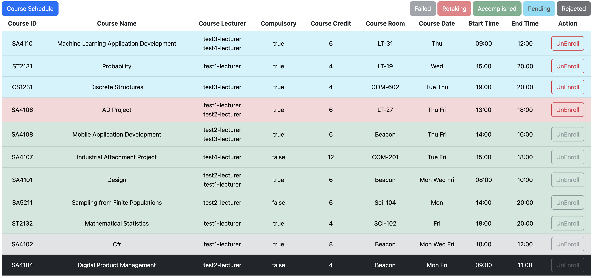

### 1. CAPS's Frontend Framework  

Part | Language | Port
 :-----: | :-----:  | :----:
**Admin** | React  | 3000
**Lecturer** | HTML | 8080
**Student** | HTML | 8080

### 2. CAPS's Basic Logic

#### 2.1 Database
Database Name|                       Admin*                       | Lecturer | Student 
 :----: |:--------------------------------------------------:|:--------:|  :----:
Student(Stu/Lec)|                      C/R/U/D                       |    -     |-
Course|                      C/R/U/D                       |    -     |-
Role*|                         R                          |    -     |-
College*|                         R                          |    -     |-
Enrollment|    D(only happened when delete course/Student)     |   R/U    |C/R/U
Grade|    D(only happened when delete course/Student)     |  C/R/U   |R
Lecturer_Course*(Generated automatically)| C/R/U/D(only happened when delete course/Lecturer) |R|R

**Admin**: This admin actor is a user who can only arrange current resources in the university. If the university would like to add a new college or new role, this CAPS admin does not have enough authorization to do that.

**Role / College** : These two tables need inheritance from university super database. They can only read and assign value to students or lecturers.

**Lecturer_Course** : This table is generated automatically when we set many-to-many relationship between course and lecturer.

#### 2.2 Grading 
Testing times |         <40 Mark          | <40 GPA |     ≥40 Mark     | ≥40 GPA
:----:|:-------------------------:|:---:|:----------------:|:----:
1| RED(When enrolling again) |F|      GREEN       |GPA Rules
2|           GRAY            |F| (GREEN) if  ≥ 50 | D+
2|           GRAY            |F| (GREEN) if < 50  |D

**SAMPLE**

#### 2.3 Visiting across roles (for typing link manually only)
~ |Admin|                Lecturer                 |Student
:----:|:----:|:---------------------------------------:|:----:
Admin| - |           Admin Current Page            |Admin Current Page
Lecturer|Admin(Without data)|                    -                    |Lecturer Main Page (View Course Taught)
Student|Admin(Without data)| Student Main Page(View Enrolled Course) |-

### 3. HOW TO RUN

#### 3.1 PRE-REQUISITE
- Java Development Kit (JDK) [JKD installment](https://www.oracle.com/java/technologies/downloads/)  
- Node. if not, please visit [Nodejs.org](https://nodejs.org/en)  
- MySQL Database Server [MySQL Community Server Download](https://dev.mysql.com/downloads/mysql/)  

#### 3.2 HOW TO RUN
1. Connect your MySQL database, then create database javaca or your own database. Remember the name of the database you choose.
2. Open the [application.properties](src/main/resources/application.properties) to modify database url (Line 2) and password (line 3) accordingly.
3. Run your [JavaCaApplication](src/main/java/com/example/javaca/JavaCaApplication.java)
4. Open the [testDB.sql](testDB.sql) with your Database Tools(such as MySQLWorkbench, HeidiSQL and etc.), if you used a different name for the database in step 1, please update database name in script. Execute the SQL script to insert the test data into the database
5. Open your Terminal / Command,  change directory to "{yourlocal_repository}/src/main/resources/react"
6. Run "npm install" (**first run only**)
7. Run "npm start" (No data, for no login any actors) and close the pop-ed out browser.
8. Re-Run your [JavaCaApplication](src/main/java/com/example/javaca/JavaCaApplication.java) (not necessary)
9. Type [http://localhost:8080](http://localhost:8080/)
10. Enjor your test!

### 4.Test Account
For Student: 
>Email : **javaCAstudent@gmail.com**
>
> Password: javaca
>
> >In order to test the Email-Service:  
> >Email Address: **javaCAstudent@gmail.com**  
> >Email Password:cba321#@!

For Lecturer:
>Email : **test1@lec.nus.edu**
> 
> Password:test1

For Admin:
>Email : **test@admin.nus.edu**
> 
> Password:test
